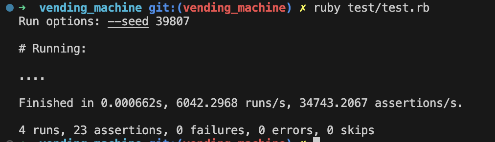
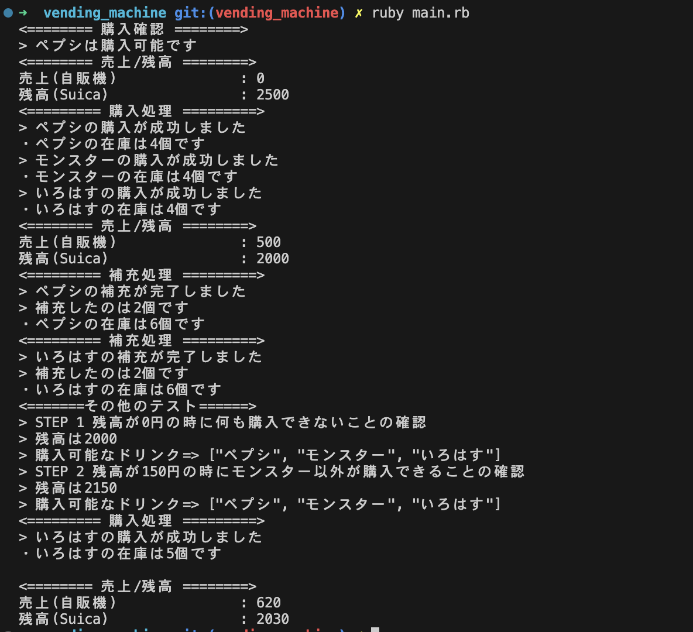

# ファイルの概要

## 主なレビュー対象です。

### 対象ファイル

1. lib/drink.rb
2. lib/suica.rb
3. lib/vending_machine.rb

### 概要

要件を満たすに必要なロジックを記載しています。

## テストコード

### 対象ファイル

test/test.rb

### 概要

* [要件](https://github.com/happiness-chain/practice/blob/main/08_ruby/003_%E8%87%AA%E8%B2%A9%E6%A9%9F%E5%95%8F%E9%A1%8C.md#%E3%82%B9%E3%83%86%E3%83%83%E3%83%971suica)をベースにテストを書いています。
* 例えば、「ステップ1　Suica」と　classの「test_suica_step_one」が対応しています
* テストは全てクリアしていることを確認済です

## 実行確認ファイル

### 対象ファイル

1. main.rb
2. output.rb

### 概要

* 要件を満たしているかはテストコードで確認できると思いますが、実際どう動くのかは「main.rb」で確認できます

* 「main.rb」に実際に使用する場合の処理を記述しています
* 「output.rb」はこのファイル無しでも実行可能ですが、視認性と確認の行いやすさを考慮した処理をまとめています
